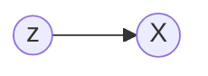

# VAE Tutorial
### Table of contents
[Introduction](##Introduction)
[Simple Methods](##SimpleMethods)
[VAE Method](##VaeMethod)
[References](##References)
[Appendix](##Appendix)
<a name="headers"/>

## Introduction
We are interested in sampling  a random variable $X$. Suppose $X$ is generated by the following process:

1. $Z$ is drawn from a **bernoulli distribution** with $p = 0.5$.
2. If $z = 1$, $X \sim \mathcal{N}([1, 1], 0.1)$, else $X \sim \mathcal{N}([-1, -1], 0.1)$.

The Bayesian Network representation of this process is:

But we don't know how this data is generated. Given the data, our goal is to uncover the process which generated this data.

## Simple Methods
1. The simplest thing would be do is **MLE**. Assume that the data is drawn from some standard distribution (ex: gaussian) and distribution parameters (ex: $\mu$ and $\sigma$ for gaussian) which maximize log likelihood. **MLE** is not ideal because we cannot capture complex, real-world distributions. Moreover, we aren't making use of the knowledge that data is produced by the process mentioned above.
2. Since, $p(x) = \int_z p(x|z)*p(z)$ and in our case $z \in \{0, 1\}$, we can assume a distribution for $p(x|z=0)$ and $p(x|z=1)$ and do **MLE**. This will work extremely well for us because it exactly captures our data generation process. But what if $\int_z p(x|z) * p(z)$ is intractable?

## VAE Method

### Preliminary Stuff

The method suggested by **VAE** is more complex. It is suited to handle arbitrarily complicated multi-dimensional distributions. It relies on the following equation for likelihood for one datapoint $x^{(i)}$:

>$log(p(x^{(i)})) = D_{KL}(q(z|x^{(i)}) || p(z|x^{(i)})) + \mathcal{L}( x^{(i)})$

Here, 
1. $p(x^{(i)})$ is the true probability of the data point $x^{(i)}$.
2. $p(z|x^{(i)})$ is the true posterior probability. 
3. $q(z|x^{(i)})$ is some arbitrary probability distribution.
4. $\mathcal{L}(x^{(i)})$ is known as the **variational lower bound**.

Try to derive what $\mathcal{L}(x^{(i)})$ should be for this equation to make sense. Use the definition of $D_{KL}$ in terms of $\mathbb{E}$ and apply Bayes Rule. The derivation is in the Appendix. The answer is:

>$\mathcal{L}(x^{(i)}) = -D_{KL} (q(z|x^{(i)})  || p(z)) +  \mathbb{E}_{q(z|x^{(i)}) }[p(x^{(i)}|z)]$ 

For complicated distributions with multi-dimensional random variables, calculating 
$D_{KL}(q(z|x^{(i)}) || p(z|x^{(i)}))$ is computationally expensive. But since this quantity is non-negative, we have:

>$log(p(x^{(i)})) \geq \mathcal{L}(x^{(i)})$ 

By maximizing $\mathcal{L}(x^{(i)})$, we can indirectly maximize $log(p(x^{(i)}))$. 
 
Note that if $\mathcal{L}(x^{(i)}) \rightarrow log(p(x^{(i)}))$ then $q(z|x^{(i)}) \rightarrow p(z|x^{(i)})$. This is because the KL-Divergence between the two distribution will go to $0$. Therefore, it is helpful to think of $q(z|x^{(i)})$ as the approximate posterior distribution.

### Modelling Assumptions

In order to calculate $\mathcal{L}(x^{(i)})$, there are $3$ distributions we have to find. We are free to choose these distributions and how to parametrize them.

1.  $q(z|x^{(i)})$: We choose some standard distribution for this with $\phi$ as the distribution parameters. For example, if we chose $q(z|x^{(i)})$ to be a gaussian, then $\phi$ would be $\mu$ and $\sigma$. Similarly, if we chose $q(z|x^{(i)})$ as the exponential distribution, then $\phi$ would be $\lambda$, the  rate parameter.
2. $p(z)$: Mostly, this distribution is chosen to be standard normal. This is a blatantly nonsensical choice. For example, in the mixture-of-gaussians example in the Introduction, $p(z)$ is clearly a bernoulli distribution! We'll come to we can make this assumption and get away later.
3. $p(x^{(i)}|z)$: As for $q(z|x^{(i)})$, we choose some standard distribution parameterized by $\theta$ to represent this.

From now on, we'll refer to  $q(z|x^{(i)})$ as $q_{\phi}(z|x^{(i)})$ and $p(x^{(i)}|z)$ as $p_{\theta}(x^{(i)}|z)$ to emphasize that these are parametrized distributions.

###  Maximizing $\mathcal{L}(x^{(i)})$

I'll consider two approaches which can be used to maximize $\mathcal{L}$. One is very simple and straightforward. The other is adopted by the **VAE** method.

1. 

## References

## Appendix

### Derivation of $\mathcal{L}$

Our original equation was 

>$log(p(x^{(i)})) = D_{KL}(q(z|x^{(i)}) || p(z|x^{(i)})) + \mathcal{L}( x^{(i)})$

By the definition of $D_{KL}$:

>$log(p(x^{(i)})) = \mathbb{E}_{q(z|x^{(i)}) }[log(\frac{q(z|x^{(i)}) }{p(z|x^{(i)})})] + \mathcal{L}(x^{(i)})$

By using Baye's Rule on $p(z|x^{(i)})$ and noticing that:

>$\mathbb{E}_{q(z|x^{(i)}) }[log(p(x^{(i)}))] = log(p(x^{(i)}))$

 We get:
  
>$log(p(x^{(i)})) = \mathbb{E}_{q(z|x^{(i)}) }[log(\frac{q(z|x^{(i)}) }{p(z) .p(x^{(i)}|z)})] + log(p(x^{(i)})) + \mathcal{L}(x^{(i)})$

Cancelling the $log(p(x^{(i)}))$ on both sides:

>$\mathcal{L}(x^{(i)}) =  -D_{KL} (q(z|x^{(i)})  || p(z)) +  \mathbb{E}_{q(z|x^{(i)}) }[p(x^{(i)}|z)]$

### KL-Divergence between two Univariate Gaussians

Let $X_1 \sim \mathcal{N}(\mu_1, \sigma_1)$ and $X_2 \sim \mathcal{N}(\mu_2, \sigma_2)$ be two Random Variables.
 The KL-Divergence between the two **pdf**s is given by: 
>$D_{KL}(p_1 || p_2) = \int p_1 log(\frac{p_1}{p_2})$

In our case $p_1(x) = \frac{e^{-\frac{(x-\mu_1)^2}{2\sigma_1^2}}}{\sqrt{2\pi}\sigma_1}$ and $p_2(x) = \frac{e^{-\frac{(x-\mu_2)^2}{2\sigma_2^2}}}{\sqrt{2\pi}\sigma_2}$.

Plug this into the above formula and simplify to get
> $D_{KL}(p_1 || p_2) = \int_{-\infty}^{+\infty}p_1(x)log(e^{-\frac{(x-\mu_1)^2}{2\sigma_1^2} + \frac{(x-\mu_2)^2}{2\sigma_2^2}}.\frac{\sigma_2}{\sigma_1}) dx$

Further, we can write.
> $= log(\frac{\sigma_2}{\sigma_1}) + \int_{-\infty}^{+\infty}p_1(x)(-\frac{(x-\mu_1)^2}{2\sigma_1^2} + \frac{(x-\mu_2)^2}{2\sigma_2^2})dx$

Observe that the first term in the integral is very close to the variance.
> $= log(\frac{\sigma_2}{\sigma_1}) - \frac{\mathbb{E}_{p_1}[(x-\mu_1)^2]}{2\sigma_1^2} +  \int_{-\infty}^{+\infty}p_1(x)\frac{(x-\mu_2)^2}{2\sigma_2^2}dx$

We'll add and subtract $\mu_1$ in the second term so that we can make it closer to the variance.
> $= log(\frac{\sigma_2}{\sigma_1}) - \frac{\sigma_1^2}{2\sigma_1^2} +  \int_{-\infty}^{+\infty}p_1(x)\frac{(x - \mu_1 + \mu_1 -\mu_2)^2}{2\sigma_2^2}dx$

On expanding the square
>$= log(\frac{\sigma_2}{\sigma_1}) - \frac{1}{2} +  \frac{1}{2\sigma_2^2}[\sigma_1^2  + (\mu_1 -\mu_2)^2 + I]$

Where $I = 2.(\mu_1 - \mu_2)\int_{-\infty}^{+\infty}p_1(x).(x - \mu_1)dx$. Converse yourself that this integral evaluates to $0$.

Hence,

>$D_{KL}(p_1 || p_2) = log(\frac{\sigma_2}{\sigma_1}) - \frac{1}{2} +  \frac{1}{2\sigma_2^2}[\sigma_1^2  + (\mu_1 -\mu_2)^2 ]$

